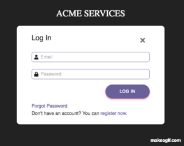

# Login Page

A simple login page using React library.

login: bart@simpsons.com password: password



## Installation

Download the repo, then run:

```bash
npm install
```

## Start-up

Start up the client inside the directory, run:

```bash
npm run start
```

&& Start up the Json-server inside the directory:

```bash
npm run json-server
```

## Technology Used
* React
* Redux
* JavaScript
* Json server
* Bable / ESlint
* Material UI
* Font Awesome
* VS Code
* Git - Github

## Authors
* **Aaron Griffiths** - (aa.griff9@gmail.com)

